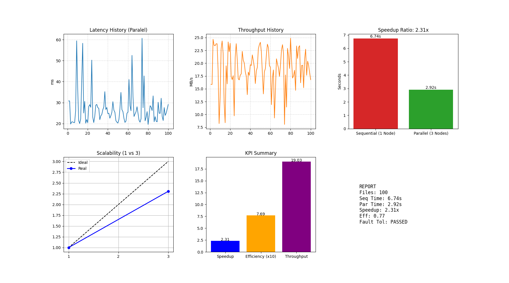

# 🌐 Mini Distributed File System (DFS-X)

<div align="center">


**Topik:** Cloud-based Distributed File Storage

[Instalasi](#-cara-instalasi--menjalankan) • [Pengujian](#-cara-melakukan-pengujian-skenario-utama) • [Fault Recovery](#-uji-coba-fault-recovery-nilai-plus)

</div>

---

## 📋 Deskripsi Proyek

Proyek ini adalah implementasi sistem file terdistribusi sederhana (mirip konsep HDFS/Google File System) yang dibangun untuk memenuhi tugas besar **"Tema 5: DFS-X"**. Sistem ini memungkinkan penyimpanan file secara terdistribusi dengan fitur keamanan data (replikasi) dan ketahanan terhadap kegagalan server (fault tolerance).

### ✨ Fitur Utama

| Fitur                          | Deskripsi                                                           |
| ------------------------------ | ------------------------------------------------------------------- |
| 🏗️ **Arsitektur Master-Slave** | 1 Master Node (Coordinator) dan 3 Data Nodes (Workers)              |
| 🔄 **Replikasi Data**          | Setiap file otomatis disalin ke 2 node berbeda (Primary & Replica)  |
| 📊 **Partisi Data**            | Beban penyimpanan dibagi rata menggunakan algoritma _Round Robin_   |
| 🔍 **Deteksi Kegagalan**       | Master mendeteksi node yang mati secara otomatis dengan _Heartbeat_ |
| 🛡️ **Pemulihan Otomatis**      | Trafik otomatis dialihkan ke node yang masih hidup                  |
| ✅ **Konsistensi Kuat**        | Validasi data tertulis di semua replika sebelum konfirmasi sukses   |

---

## 📁 Struktur Direktori

```text
dfs-x/
│
├── protos/
│   ├── dfs.proto        # Definisi kontrak komunikasi gRPC
│   ├── dfs_pb2.py       # (Auto-generated code)
│   └── dfs_pb2_grpc.py  # (Auto-generated code)
│
├── storage/             # Tambahkan manual Folder storage karena folder ini kosong sehingga tidak ke upload di repository
│   ├── node1/
│   ├── node2/
│   └── node3/
│
├── client.py            # Script pengujian (Upload 100 file)
├── datanode.py          # Script untuk Worker Node
├── master.py            # Script untuk Master Node
├── Dockerfile           # Konfigurasi image Docker
├── docker-compose.yml   # Konfigurasi jaringan & container
├── requirements.txt     # Daftar pustaka Python
└── README.md            # Dokumentasi ini
```

---

## 🔧 Prasyarat Sistem

Sebelum menjalankan, pastikan komputer Anda memiliki:

- ✅ **Docker Desktop** (Pastikan statusnya _Running_)
- ✅ **Python 3.8+** (Untuk generate proto jika diperlukan di lokal)

### 📦 Instalasi Docker Desktop

<details>
<summary><b>🪟 Windows</b></summary>

1. Download Docker Desktop dari [docker.com/products/docker-desktop](https://www.docker.com/products/docker-desktop/)
2. Jalankan installer `Docker Desktop Installer.exe`
3. Ikuti wizard instalasi (pastikan WSL 2 diaktifkan)
4. Restart komputer setelah instalasi
5. Buka Docker Desktop dan tunggu hingga status berubah menjadi "Running"
6. Verifikasi instalasi:
   ```bash
   docker --version
   docker-compose --version
   ```

</details>

<details>
<summary><b>🍎 macOS</b></summary>

1. Download Docker Desktop dari [docker.com/products/docker-desktop](https://www.docker.com/products/docker-desktop/)
2. Buka file `.dmg` yang didownload
3. Drag Docker icon ke folder Applications
4. Buka Docker dari Applications
5. Verifikasi instalasi:
   ```bash
   docker --version
   docker-compose --version
   ```

</details>

<details>
<summary><b>🐧 Linux (Ubuntu/Debian)</b></summary>

```bash
# Update package index
sudo apt-get update

# Install dependencies
sudo apt-get install ca-certificates curl gnupg lsb-release

# Add Docker's official GPG key
sudo mkdir -p /etc/apt/keyrings
curl -fsSL https://download.docker.com/linux/ubuntu/gpg | sudo gpg --dearmor -o /etc/apt/keyrings/docker.gpg

# Set up repository
echo \
  "deb [arch=$(dpkg --print-architecture) signed-by=/etc/apt/keyrings/docker.gpg] https://download.docker.com/linux/ubuntu \
  $(lsb_release -cs) stable" | sudo tee /etc/apt/sources.list.d/docker.list > /dev/null

# Install Docker Engine
sudo apt-get update
sudo apt-get install docker-ce docker-ce-cli containerd.io docker-compose-plugin

# Verifikasi instalasi
docker --version
docker compose version
```

**Opsional:** Jalankan Docker tanpa sudo

```bash
sudo groupadd docker
sudo usermod -aG docker $USER
newgrp docker
```

</details>

### 🔨 Instalasi Protocol Buffers Compiler

<details>
<summary><b>🪟 Windows</b></summary>

**Metode 1: Menggunakan Chocolatey (Recommended)**

```bash
choco install protoc
```

**Metode 2: Manual Download**

1. Download protoc dari [GitHub Releases](https://github.com/protocolbuffers/protobuf/releases)
2. Pilih file `protoc-xx.x-win64.zip`
3. Extract ke folder (misal: `C:\protoc`)
4. Tambahkan `C:\protoc\bin` ke System PATH
5. Verifikasi:
   ```bash
   protoc --version
   ```

</details>

<details>
<summary><b>🍎 macOS</b></summary>

**Menggunakan Homebrew:**

```bash
brew install protobuf
```

**Verifikasi instalasi:**

```bash
protoc --version
```

</details>

<details>
<summary><b>🐧 Linux (Ubuntu/Debian)</b></summary>

```bash
# Install protobuf compiler
sudo apt-get update
sudo apt-get install -y protobuf-compiler

# Verifikasi instalasi
protoc --version
```

**Jika ingin versi terbaru:**

```bash
# Download latest release
PROTOC_VERSION=25.1  # Sesuaikan dengan versi terbaru
wget https://github.com/protocolbuffers/protobuf/releases/download/v${PROTOC_VERSION}/protoc-${PROTOC_VERSION}-linux-x86_64.zip

# Extract
unzip protoc-${PROTOC_VERSION}-linux-x86_64.zip -d $HOME/.local

# Verifikasi
protoc --version
```

</details>

---

## 🚀 Cara Instalasi & Menjalankan

### Langkah 1: Generate Kode gRPC

Meskipun Dockerfile akan melakukannya otomatis di dalam container, disarankan menjalankannya di lokal agar IDE tidak error.

Buka terminal di folder `dfs-x` dan jalankan:

```bash
pip install grpcio-tools protobuf
python -m grpc_tools.protoc -I. --python_out=. --grpc_python_out=. protos/dfs.proto
```

### Langkah 2: Build & Jalankan Server

Jalankan perintah berikut untuk membangun image dan menyalakan 4 server sekaligus:

```bash
docker-compose up --build
```

> 💡 **Tips:**
>
> - Biarkan terminal ini terbuka
> - Tunggu hingga muncul log: `[Master] Server berjalan...` dan `[datanode-x] Siap di port 50051`

---

## 🧪 Cara Melakukan Pengujian (Skenario Utama)

Sesuai spesifikasi, kita akan menguji upload **100 file (Total 50 MB)**.

> ⚠️ **PENTING:** Script `client.py` harus dijalankan **dari dalam container Master** agar bisa mengenali nama host `datanode-1`, dll.

### Langkah Pengujian:

1. **Buka terminal baru** (Terminal Docker jangan ditutup)

2. **Cek nama container Master:**

   ```bash
   docker ps
   ```

   _(Cari yang namanya mengandung `master-node`, misal: `dfs-x-master-node-1`)_

3. **Masuk ke dalam container Master:**

   ```bash
   docker exec -it dfs-x-master-node-1 /bin/bash
   ```

4. **Jalankan pengujian:**
   ```bash
   python client.py
   ```

### 📊 Output yang Diharapkan:

<div align="center">
  
</div>

> 📈 _Data ini bisa Anda gunakan untuk membuat grafik di laporan._

---

## 🔥 Uji Coba Fault Recovery (Nilai Plus)

Untuk membuktikan sistem tahan banting (Failover), lakukan langkah ini saat pengujian sedang berjalan:

### Skenario Fault Tolerance:

1. **Jalankan** `client.py` di terminal container

2. **Saat proses berjalan** (misal di file ke-20), buka terminal host lain dan matikan salah satu node:

   ```bash
   docker stop dfs-x-datanode-2
   ```

3. **🎯 Hasil yang Diharapkan:**
   - ✅ Di log Master akan muncul: `[Master] ALERT: datanode-2 dianggap MATI/DOWN!`
   - ✅ Client **TIDAK AKAN ERROR**
   - ✅ Upload file berikutnya otomatis dialihkan hanya ke `datanode-1` dan `datanode-3`
   - ✅ Sistem tetap berjalan normal meskipun kehilangan 1 server

---

## 🧹 Membersihkan Data (Reset)

Jika ingin mengulang pengujian dari awal yang bersih:

1. **Matikan Docker:**

   ```bash
   docker-compose down
   ```

2. **Hapus file `.bin`** di dalam folder `storage/node1`, `node2`, dan `node3`

   ```bash
   Remove-Item -Path "storage\node*\*" -Recurse -Force
   ```

3. **Jalankan kembali:**
   ```bash
   docker-compose up --build
   ```

---

## 📚 Teknologi yang Digunakan

<div align="center">

| Teknologi            | Kegunaan                   |
| -------------------- | -------------------------- |
| **Python**           | Bahasa pemrograman utama   |
| **gRPC**             | Komunikasi antar service   |
| **Protocol Buffers** | Serialisasi data           |
| **Docker**           | Containerization           |
| **Docker Compose**   | Orkestrasi multi-container |

</div>

---

## 👥 Informasi Pengembang

**Dikembangkan oleh:** Kelompok 8 D KPT  
**Anggota:** Isep Hidayattuloh 237006101, Rizal Saepul Anwar 237006107, Ghufron Faishal Ihsan 237006114  
**Mata Kuliah:** Komputasi Paralel & Terdistribusi

---

<div align="center">

**⭐ Jika proyek ini membantu, jangan lupa berikan star! ⭐**

</div>
